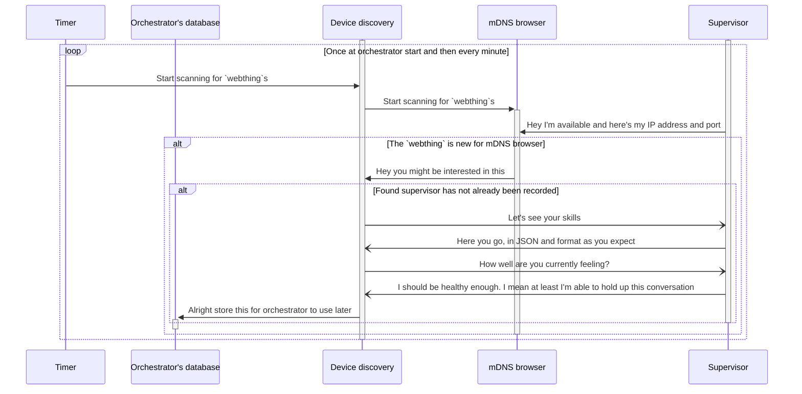

# Supervisor discovery
You could say that the [supervisor](https://github.com/LiquidAI-project/wasmiot-supervisor) has similar jobs to [the node components in Kubernetes](https://kubernetes.io/docs/concepts/overview/components/#node-components).
An instance of it is run on each device or "node" and is responsible for setting up an isolated environment and HTTP-endpoints for running WebAssembly functions.

Upon starting, the supervisor-device has to be found by orchestrator, which it does by advertising itself as `webthing` via mDNS during the whole of its uptime.
When the device is new and device discovery on orchestrator server notices this advertisement, it queries the device's description and health which are by default available at device paths `/.well-known/wasmiot-device-description` and `/health` respectively.
Device discovery saves all of this information (i.e., mDNS record addresses and port, capability description and health) in the database.
Now the discovery process has ended and the found devices can be queried at orchestrator API's path `/file/device`.

The following sequence diagram depicts the process:

This scanning and discovery process is run every minute, when the mDNS scanning is restarted on
a timer or when explicitly requested by a user on orchestrator API's path `/discovery/reset`.
A device is forgotten and wiped from database in a couple cases:
- Device fails to properly respond to description query at discovery
- Device emits a goodbye that mDNS browser recognizes
- Device fails to respond to health queries that run every minute or so
- `DELETE` is requested on orchestrator API's path `/file/device`, which wipes __all devices__
