# Liquid functionality in Wasm-IoT

## Migration sequence

```mermaid
%%{ init : { "theme" : "default", "flowchart" : { "curve" : "linear" }}}%%
flowchart LR
    %% Definitions.
    S1((S1))
    S2((S2))
    S3((S3))
    O[/O\]

    %% Arrows. Note the order for a better supervisors-first-row layout.
    S3-- "❌" ---xS1
    S1-- "💦⚙️" --->S2
    O--  "✅" --->S2
    S3-- "❓" --->O
    S1-- "⚠️" --->O
```

Explanations for the actions in the (expected) order of events:
- ⚠️: _Supervisor1_ (`S1`) shuts down graciously for example due to _orchestrator_'s (`O`)
  request or a computation-performance-based rule placed on the supervisor itself.
- 💦⚙️: _Supervisor1_ __migrates__ its modules' files and execution state to _Supervisor2_ (`S2`).
- ✅: _Orchestrator_ acknowledges the migration and reconfigures the associated
  deployments according to this change.
- ❌: _Supervisor3_ (`S3`) tries to connect to Supervisor1 but it is no longer available
  (having shut down).
- ❓: _Supervisor3_ queries orchestrator about the incident and _orchestrator_
  "reroutes" _Supervisor3_ to make requests it depends on to _Supervisor2_
  instead from now on.

